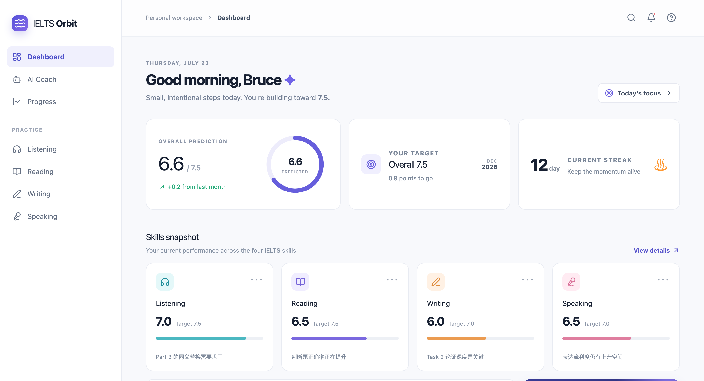

# IELTS Orbit 🚀

An AI-powered IELTS training dashboard designed to help learners track progress and improve English skills.
## Live Demo

https://ielts-orbit.netlify.app
## Overview

IELTS Orbit is a frontend web application that provides a structured learning environment for IELTS preparation.

## Features

- 📊 Learning progress dashboard
- 📝 IELTS skill tracking
- 🎯 Personalised study overview
- 📱 Responsive user interface

## Tech Stack

- React
- Vite
- JavaScript
- Tailwind CSS
- Lucide React
- Netlify Deployment

## Future Improvements

- AI-powered writing feedback
- Speaking practice assistant
- User authentication
- Learning analytics dashboard
